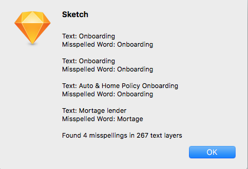

# Spell Check Whole Page
Run spell check on all text layers in the page.

Displays a list of all text that has a spelling error and the misspelled word.

Uses OSX's built-in spelling features and dictionary to do this.

## The problem
Spell check isn't available for all text layers at a time. If you're using sketch as a replacement for illustrator or inDesign, you really miss the ability to automatically spell check everything everywhere.

## Usage
**To install it, simply [download the zip](https://github.com/ethology-co/sketch-spellcheck-whole-page/archive/master.zip) and double-click the “.sketchplugin” file.** You can access the plugin via the plugins menu. You’ll know its worked when you see the notification at the bottom of the screen.

Here’s a screen capture of the plugin in action:

## Special thanks

Special thanks to [Aby Nimbalkar](https://github.com/abynim), who's [select layers of type gist](https://gist.github.com/abynim/04f88d5e4fe47118bfe3#file-sketch-plugin-snippet-select-layers-of-type-js) started me off in creating this plugin

## Next Steps:

Next steps are to loop this in to the built-in spelling window to allow people to natively find and replace the misspelled text. But this is a start anyway!

- Allow replacing of misspelled text
- Implement skipping through text layers one-by-one
